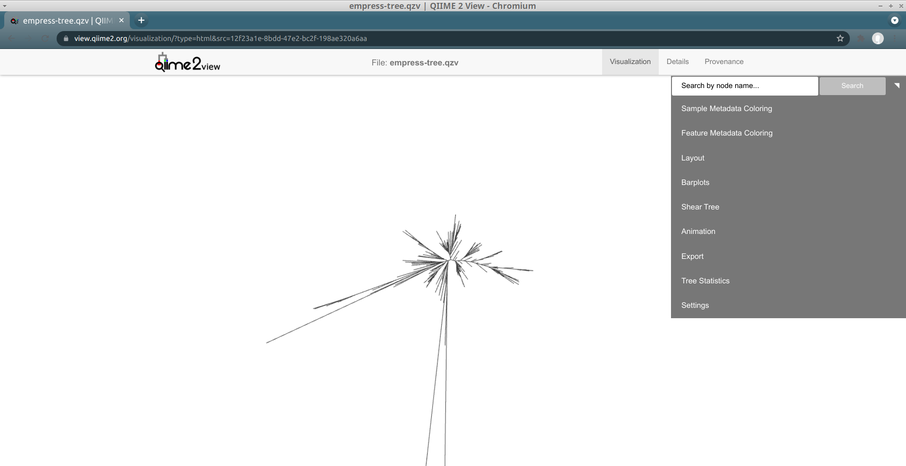
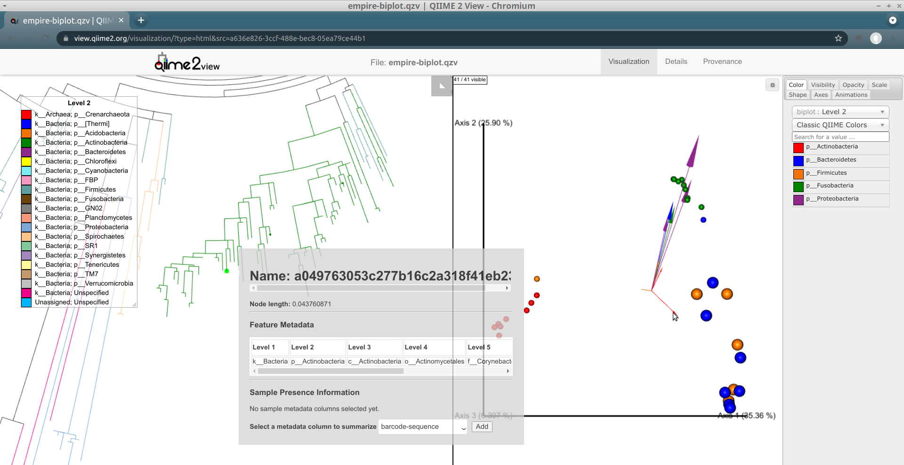

# Empress
 [](https://travis-ci.org/biocore/empress)

<!---Empress Logo--->

# Introduction  

Empress is a fast and scalable [phylogenetic tree](https://en.wikipedia.org/wiki/Phylogenetic_tree) viewer that lets you interactively explore the hierarchical relationships between features in your dataset. While historically these features often represented evolutionary relationships of species in community surveys, and are characterized by their phylogeny or genetic similarity/differences, you can in fact view any type of information with hierarchical organization. For example, you can view trees of amplicon sequence variants (ASVs), or metabolite trees of LC-MS data using [q2-qemistree](https://github.com/anupriyatripathi/q2-qemistree) ([ref](https://www.biorxiv.org/content/10.1101/2020.05.04.077636v1)).


# Installation   

Currently, Empress is only accessible as a QIIME 2 plugin. To follow this tutorial you will need to have a QIIME 2 (version 2019.10 or newer) conda environment installed and activated. See the [QIIME 2 installation](https://docs.qiime2.org/2020.6/install/) page for installation instructions.  
Once you have QIIME 2 installed, make sure the conda environment is activated by running:    

```
conda activate qiime2-2020.6
```

You can replace `qiime2-2020.6` above with whichever version of QIIME 2 you have currently installed.  

Now we are ready to install Empress. Run the following codes:  

```
pip install git+https://github.com/biocore/empress.git
qiime dev refresh-cache
qiime empress --help
```

If you see information about Empress' QIIME 2 plugin, the installation was successful!   

# Example: Using Empress in QIIME 2   

In this tutorial we will be using Empress within the QIIME 2 environment, and demonstrating its basic usage with the [Moving Pictures tutorial](https://docs.qiime2.org/2020.6/tutorials/moving-pictures/) dataset, a set of human microbiome samples from two individuals at four body sites across five timepoints.  

## Downloading Input Artifacts and Metadata  

Before we start, we’ll need to download the necessary input artifacts which are produced following the [Moving Pictures Tutorial](https://docs.qiime2.org/2020.6/tutorials/moving-pictures/), these are:  

1. A feature-table, a *FeatureTable[Frequency]* type artifact  
1. A sample metadata file, tab-separated value format *txt/tsv*  
1. A rooted tree, a *Phylogeny[Rooted]* type artifact  
1. Taxonomic assignments of our features, a *FeatureData[Taxonomy]* type artifact  
1. A PCoA biplot results file, *PCoAResults % Properties('biplot')* type artifact produced by [qiime diversity pcoa](https://docs.qiime2.org/2020.6/plugins/available/diversity/pcoa-biplot/) plugin  

The last 2 items are required only when displaying an Empress tree plot in tandem with an Emperor PCoA plot/biplot (a.k.a Empire plot!)
  
You can download these files individually by clicking the links below, or using `wget` to download them directly from your terminal.  

- `table.qza` [view](https://view.qiime2.org/?src=https%3A%2F%2Fdocs.qiime2.org%2F2019.10%2Fdata%2Ftutorials%2Fmoving-pictures%2Ftable.qza) | [download](https://docs.qiime2.org/2019.10/data/tutorials/moving-pictures/table.qza)
- `sample_metadata.tsv` [download](https://data.qiime2.org/2019.10/tutorials/moving-pictures/sample_metadata.tsv)
- `rooted-tree.qza` [view](https://view.qiime2.org/?src=https%3A%2F%2Fdocs.qiime2.org%2F2019.10%2Fdata%2Ftutorials%2Fmoving-pictures%2Frooted-tree.qza) | [download](https://docs.qiime2.org/2019.10/data/tutorials/moving-pictures/rooted-tree.qza)
- `taxonomy.qza` [view](https://view.qiime2.org/?src=https%3A%2F%2Fdocs.qiime2.org%2F2019.10%2Fdata%2Ftutorials%2Fmoving-pictures%2Ftaxonomy.qza) | [download](https://docs.qiime2.org/2019.10/data/tutorials/moving-pictures/taxonomy.qza)
- `biplot.qza` [view](https://view.qiime2.org/?src=https%3A%2F%2Fraw.githubusercontent.com%2Fbiocore%2Fempress%2Fmaster%2Fdocs%2Fmoving-pictures%2Fbiplot.qza) | [download](https://raw.githubusercontent.com/biocore/empress/master/docs/moving-pictures/biplot.qza)   

First we’ll create a directory to download our files to and change into it:  

```bash
mkdir empress-tutorial
cd empress-tutorial
```

Now download the files:   
```bash
wget https://docs.qiime2.org/2019.10/data/tutorials/moving-pictures/table.qza
wget https://data.qiime2.org/2019.10/tutorials/moving-pictures/sample_metadata.tsv
wget https://docs.qiime2.org/2019.10/data/tutorials/moving-pictures/rooted-tree.qza
wget https://docs.qiime2.org/2019.10/data/tutorials/moving-pictures/taxonomy.qza
wget https://raw.githubusercontent.com/biocore/empress/master/docs/moving-pictures/biplot.qza
```

We are now ready to create our interactive tree plot.  

## Empress Plot  

We’ll start with a simple stand-alone tree visualization artifact and explore our tree using the various features.   

```bash
qiime empress plot \
    --i-tree rooted-tree.qza \
    --i-feature-table table.qza \
    --m-sample-metadata-file sample_metadata.tsv \
    --m-feature-metadata-file taxonomy.qza \
    --o-visualization empress-tree.qzv
```
- `empress-tree.qzv` [view](https://view.qiime2.org/?src=https%3A%2F%2Fraw.githubusercontent.com%2Fbiocore%2Fempress%2Fmaster%2Fdocs%2Fmoving-pictures%2Fempress-tree.qzv) | [download](https://raw.githubusercontent.com/biocore/empress/master/docs/moving-pictures/empress-tree.qzv)

To view the newly made `empress-tree.qzv` artifact, you can drag and drop the file onto [https://view.qiime2.org/](https://view.qiime2.org/) or load it locally by running:   

```bash
qiime tools view empress-tree.qzv
```


The starting plot is a simple unrooted tree which has all the normal properties of a phylogenetic tree. The outermost “tips” of the tree are referred to as “leafs”, “terminal nodes”, or “external nodes” and here represent a unique ASV. The line connected to this external node is referred to as a “branch”. A branch connects two or more nodes, in this case an external node to an internal node. These internal nodes represent a divergent point between nodes and the branch length represents the evolutionary distance between divergence points.  
You can use your mouse’s scroll wheel to zoom in and out, and click and drag anywhere on the plot to move the display to take a closer look at the various tree components. On the top-right we see a display menu with several subcategories that allow us to customize the plot. We will explore these options in more detail below.  


### Exploring individual features  

The first thing you likely noticed in this plot is the presence of several very long branches that stand out relative to the others. Let’s investigate these further. Zoom in on the external node of the longest branch and click on the node.   


A new node-viewer window appears with details about the selected node, including its name and taxonomic assignment. You’ll notice that this feature has -unexpectedly- only been classified at the Kingdom level, meaning that our feature-classifier was not able to find a suitable match in our reference database (Greengenes).  More often than not, these features correspond to non-biological reads such as chimeras, contaminants, or reads that have [index-hopped](https://www.illumina.com/content/dam/illumina-marketing/documents/products/whitepapers/index-hopping-white-paper-770-2017-004.pdf) from other samples. We will explore these possibilities further later. Also note that the tree used in this tutorial was built using the common *de novo* tree-building approach and it has previously been shown that the presence of these outlier branches in *de novo* trees can lead to artificial clustering of samples [(Jansenn et. al 2018)](https://msystems.asm.org/content/3/3/e00021-18).  
In this window we can also select to view details about sample-metadata related to this feature. From the drop down menu select `body-site` and click the *Add* button. A new *Sample Presence Information* summary table appears which displays the number of samples containing the selected feature. We can see that our ASV is present in only 1 *left palm* sample. You can select multiple metadata columns. While the table here does not give us information about the abundance of this feature, we can easily search the feature name in the [feature-table summary visualization](https://view.qiime2.org/visualization/?src=https%3A%2F%2Fdocs.qiime2.org%2F2020.6%2Fdata%2Ftutorials%2Fmoving-pictures%2Ftable.qzv&type=html) artifact created previously in Moving Pictures tutorial. From there we see that this particular feature has a total abundance of 2, which is another strong indicator of a non-biological read. Try clicking the external nodes in a few other outlier branches. Do you see a similar pattern? Now try clicking on an external node of one of the shorter branches. Notice the much improved classification!  


 
We can also locate specific features of interest using the search bar at the top of the main menu. For example, in our feature-table the most abundant ASV is `4b5eeb300368260019c1fbc7a3c718fc`. Paste this name in to the search bar and click *Search*.  
The feature’s external node is now highlighted on the tree as a bright green circle. The most abundant ASV is a species belonging to the Bacteroides genus.  


### Exploring groups of features  

Another way of exploring the classification of our features is to color the branches based on their taxonomic designation. From the main menu, click *Feature Metadata Coloring*, check the *Color by…* box and select *Level 2* which here corresponds to the Phylum level, and click *Update*.  


The plot is now updated so each branch is now colored by their Phylum level classification. We can see that the extra long branches are all the same color. Hover the cursor over the legend box and scroll to the bottom. The magenta color corresponds to an *Unspecified* Phylum. You may also have noticed that these outlier branches appear mainly in 2 distinct clusters. While we don’t have any more information about the classification of these features, perhaps we can gain some more insight regarding their classification by looking at their closest common ancestors that do have taxonomic information.   

### Exploring a feature’s closest common ancestors  

So far, we’ve looked at our data using the default unrooted tree view. To visually locate these features’ closest common ancestors, it may be easier to switch to a different layout. From the main menu, click *Layout* then select *Circular* (or *Rectangular*). Our plot automatically switches to a rooted circular cladogram.   
 
Now zoom into the longest branch of the top cluster and click on the closest external node that has a different Phylum classification (light blue).   


Interestingly, we see that this node is classified as Acanthamoeba Palestinensis which is actually not a bacteria but rather a protozoa. It is not uncommon for certain Eukaryotes to appear in bacterial/archaeal reference databases as they may share a similar genetic lineage. Remember that mitochondria and chloroplasts likely evolved from prokaryotes themselves. Explore a few other common ancestral nodes from different outlier branches. We can see other surprising appearances by Cucurbita pepo (a variety of squash or pumpkin), Raphanus sativus (radish), and Streptophyta (an order of plants). Based on these results one might speculate that our *Unspecified* features likely also belong to either plants or protozoa groups rather than bacteria. Further, since these features appear only on the palm samples, it’s possible the source of these are in fact environmental contaminants rather than common human microbes.  

In summary, given the branch length of these features, their very low abundance, lack of close matches in the reference database, and having non-microbial closest common ancestors, it is probably safe to filter these features from our table as non-biologically relevant reads.  

  
### Identifying group-specific features   

The composition of microbial communities of the gut, tongue, and palms are very different from each other. Suppose we are interested in identifying which features are unique to each body-site and their evolutionary relationships. We can do this in Empress by colorizing our tree based on columns from our sample metadata file. From the main menu, click *Sample Metadata Coloring*, check the *Color by…* box, and from the drop-down menu select `body-site`. Click the *Update* button.  


In this plot the colored branches represent lineages that are unique to the corresponding body site while the greyed branches are those that are shared across at least 2 body-sites and thus cannot be displayed with a single color. While it is not surprising to see a large number of unique features in the gut samples (red) compared to the palm samples (blue and orange), it is interesting to see a large number of unique features between the left and right palm. Can you think of any biological reasons why the left and right palms may contain such different unique microbes? Even though the left and right palm do harbor unique features, the representative clades appear more integrated among themselves, suggesting that their phylogeny are still more similar to each other than the gut taxa which appear to cluster mainly among themselves.  


## Exporting Plots  

Once you are done customizing your tree, you can export the tree as an .SVG file by going to the *Export* section in the main menu and clicking on `Export tree as SVG`.  


## Empire plots! Side-by-side integration of tree and PCoA plots  

Now that you are familiar with basics, let’s try something a bit more advanced. One of the unique features of Empress is its ability to integrate a tree plot with an [Emperor](http://emperor.microbio.me/uno/) PCoA plot and visualize them side-by-side (these plots are internally referred to as Empire plots). To achieve this we provide a PCoA matrix (*PCoAResults* type artifact), which can be any beta diversity distance matrix, including biplots. Ordination biplots that are made using the [qiime diversity pcoa-biplot](https://docs.qiime2.org/2020.6/plugins/available/diversity/pcoa-biplot/) plugin, incorporate feature loadings represented by arrows that describe explanatory variables in the dataset. This functionality is also compatible with [`DEICODE` biplots](https://github.com/biocore/deicode). In this example we’ll use a PCoA biplot calculated using Unweighted UniFrac distances. To create this new plot, run the following:  

```bash
qiime empress plot \
    --i-tree rooted-tree.qza \
    --i-pcoa biplot.qza \
    --i-feature-table table.qza \
    --m-sample-metadata-file sample_metadata.tsv \
    --m-feature-metadata-file taxonomy.qza \
    --p-filter-extra-samples \
    --p-number-of-features 10 \
    --o-visualization empire-biplot.qzv
```

- `empire-biplot.qzv` [view](https://view.qiime2.org/?src=https%3A%2F%2Fraw.githubusercontent.com%2Fbiocore%2Fempress%2Fmaster%2Fdocs%2Fmoving-pictures%2Fempire-biplot.qzv) | [download](https://raw.githubusercontent.com/biocore/empress/master/docs/moving-pictures/empire-biplot.qzv)

Load the new Empire plot. Here we see the Empress plot as before on the left, and on the right is an Emperor PCoA biplot. If you are unfamiliar with Emperor plots, you can learn more about them [here](http://emperor.microbio.me/). Briefly, each individual circle represents a single sample’s microbial community and the distances between these circles corresponds to the Unweighted UniFrac distance between them in a reduced dimensional space. The top 10 explanatory features are shown as arrows alongside their id names. The number of features that is shown on the biplot is determined by the `--p-number-of-features` parameter.  
For clarity, let’s remove the long feature-id labels. Right click anywhere on the Emperor plot and select *Toggle label visibility*. Next, in Emperor, from the main menu click on *Select a color category* and select `body-site` under the *scatter* subheading. Now our samples are color coded based on their body site origin. Notice the clear clustering of these sample-types. Next, click on the same drop-down menu and this time under the *biplot* subheading select `Level 2`. Now we can see the top explanatory features (arrows) colored by their Phyla designation. Switch over to Empress, change the plot layout to *Circular*, and set the *Feature metadata coloring* to `Level 2` also. Minimize the menu bar to fully appreciate the plots!   


### Interacting with tree-PCoA plots  

Looking at our Emperor plot, we see a single feature from the Actinobacteria Phylum (small red arrow) that is associated with the palm samples. Click on this arrow; two changes automatically occur: 1) on the Emperor plot, the samples that contain that feature will go dim, and 2) in Empress, the plot will zoom in on the external node corresponding to that feature, where you can explore the feature’s details further as before.  



This interaction between Empress and Emperor can go the other direction. Selecting a node on the Empress plot will dim the samples in Emperor in which that feature is present in.  

Another way to explore our data is to select samples on Emperor and look for the corresponding features in Empress. In Emperor, hold the shift button and draw a box around a sample. The Empress plot will now temporarily highlight the branches corresponding to that sample. If you select multiple samples from different body-sites, Empress will only highlight the branches/nodes that are unique to those sample types. The shared branches remain grey. Let’s see how we can utilize this function in our dataset.   
You may have noticed that in the Emperor plot, one of the *Right Palm* samples, is strangely clustering closer to the gut samples rather than the other palm samples. On Emperor, select some of the gut samples as well as some of the palm samples from the right hand side, taking care to not include the outlier palm sample on the left. On the Empress plot you will see several branches light up as either red, orange, or blue. These colors represent the unique features found in only that body-site, shared features are left grey.  


Once the samples have been deselected (within a couple of seconds), select the outlier palm sample + one of the gut samples. What do you notice? You’ll see that there are very few unique orange branches light up, suggesting that this sample shares many more features with the gut samples than the other palm samples.  


This is a good example of when your data can tell you something about your metadata that you may have missed. In reality, in this experiment, this palm sample was in fact mislabelled by accident.  

## Additional Considerations

**Note**: When your ordination was created from a subset of your original dataset (e.g. the feature table was rarefied, or certain low-frequency features or samples were otherwise filtered out), we recommend that you carefully consider *which* feature table you would like to visualize in Empress. You can use either:
                                                                                
- A *filtered table* that matches the ordination (e.g. with rarefaction done, and/or with low-abundance features/samples removed), or
- A *raw table* -- that is, the original table before performing rarefaction/filtering for the ordination.

There are some pros and cons for either of these choices. If you use a *filtered table*, then the Empress visualization will include less data than in the *raw dataset*: this will impact sample presence information, sample metadata coloring, and other parts of the visualization. If you select the *raw table*, you might find that some nodes in the tree won't be represented by any of the samples in the ordination (if the ordination was made using a *filtered table*, and `--p-no-filter-unobserved-features-from-phylogeny` is used). If you'd like to read more about this, there's some informal discussion in [pull request 237](https://github.com/biocore/empress/pull/237).

The command above uses the *raw dataset* and removes extra samples not represented in the ordination (using the `--p-filter-extra-samples` flag)
 
<!---# Animations   

One unique feature that makes Empress useful for exploring time-series data or making exciting presentations is its animation capability, which allows us to stratify and view our data at each time point rather than all at once. To set up the animation sequence, click on the Animation section from the main menu. From the *Gradient* drop-down menu, select `days-since-experiment-start`, the number of unique values in this column will be equal to the number of sequences we see in the final animation. From the *Trajectory* drop-down menu, select `body-site`, this will be the grouping factor by which the branch colors will be set to. Remember that colors on the plot represent branches unique to that group, branches that are shared between groups are not colored. Click on the `Start` button to initiate the animation and minimize the menu to view the full plot. You will begin to see a sequence of plots (automatically changing every few seconds) that represent the data at each time point found in the *days-since-experiment-start* column. At any point you can pause the animation by clicking on the `Pause` button and manually browse through the time points using the `Next Frame`, `Previous Frame`, or `Resume` buttons. Click `Stop` to terminate the animations. ---> 

# Acknowledgements

This work is supported by IBM Research AI through the AI Horizons Network. For
more information visit the [IBM AI Horizons Network website](https://www.research.ibm.com/artificial-intelligence/horizons-network/).  

Empress' JavaScript code is distributed with the source code of various
third-party dependencies (in the `empress/support_files/vendor/` directory).
Please see
[DEPENDENCY_LICENSES.md](https://github.com/biocore/empress/blob/master/DEPENDENCY_LICENSES.md)
for copies of these dependencies' licenses.
