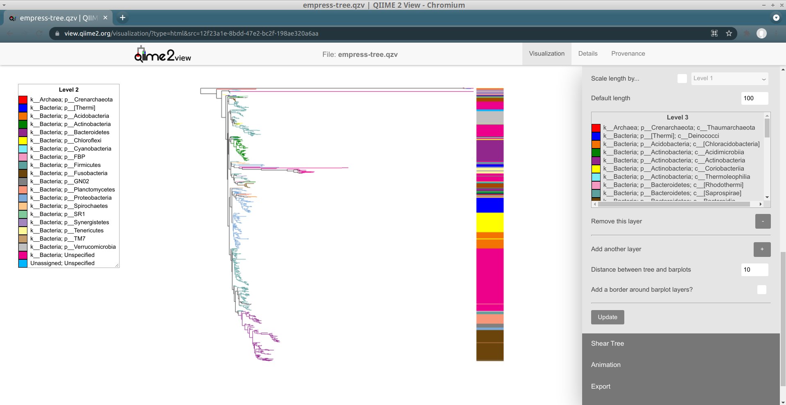
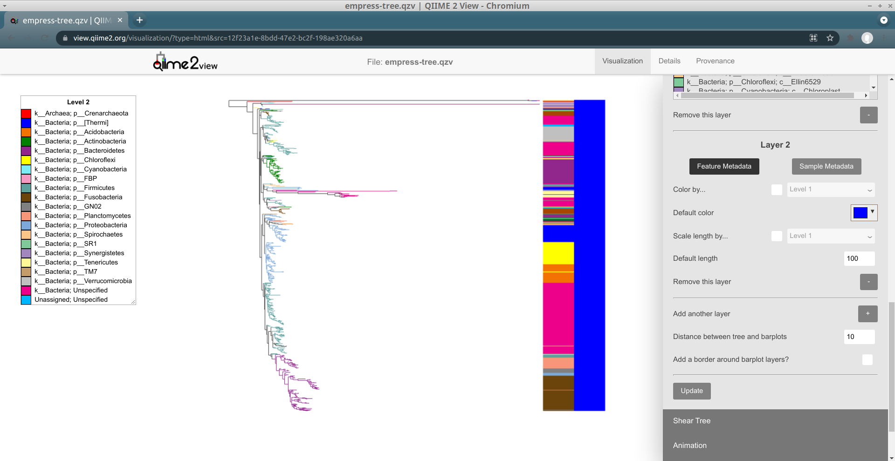
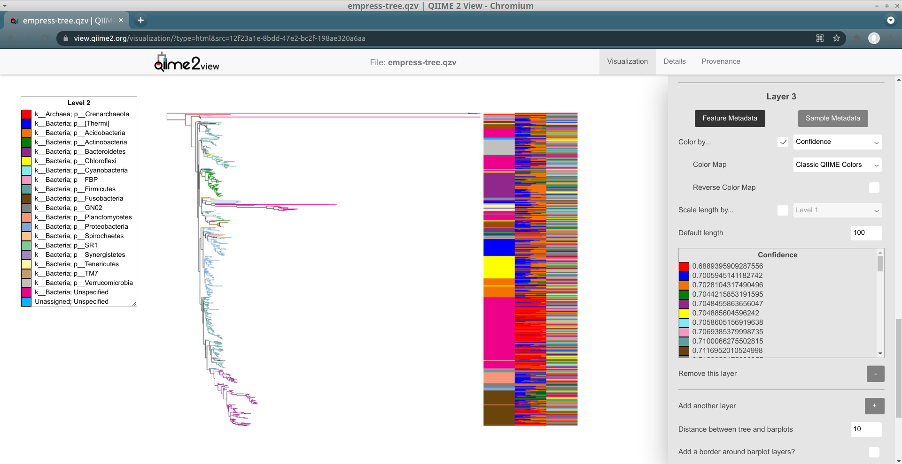
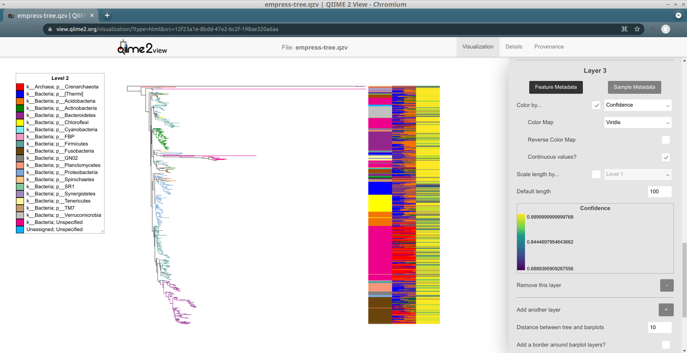
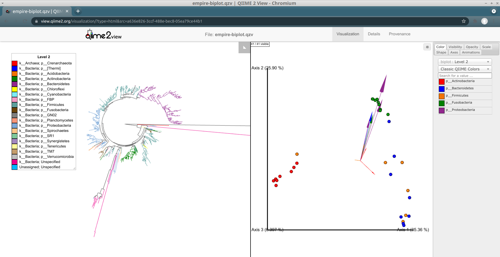
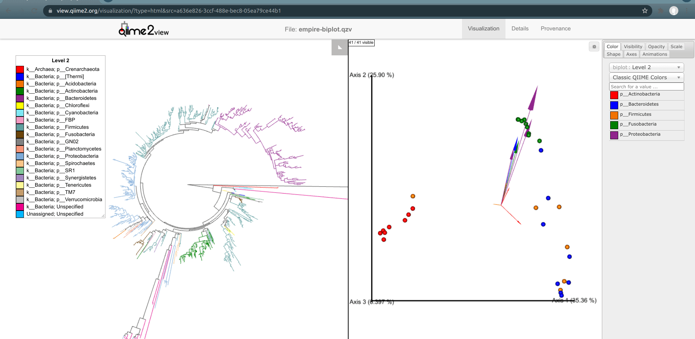

# Empress
[](https://travis-ci.org/biocore/empress)

<!---Empress Logo--->

# Introduction  

Empress is a fast and scalable [phylogenetic tree](https://en.wikipedia.org/wiki/Phylogenetic_tree) viewer that helps interactively explore the hierarchical relationships between features in a dataset.

While historically these features have often represented evolutionary relationships of species in community surveys, and are characterized by their phylogeny or genetic similarity/differences, you can in fact view any type of information with hierarchical organization. For example, you can view trees of [amplicon sequence variants (ASVs)](https://en.wikipedia.org/wiki/Amplicon_sequence_variant) generated from 16S rRNA marker gene sequencing data, or metabolite trees of LC-MS data using [q2-qemistree](https://github.com/biocore/q2-qemistree) ([ref](https://www.biorxiv.org/content/10.1101/2020.05.04.077636v1)).

Empress supports categorically new functionality, such as animations and
integration with ordination plots, as well as functionality common to
established tree viewers (e.g. metadata coloring, clade collapsing,
and barplots).

## Screenshot


<div align="center">
<i>"Empire plot" visualizing a phylogenetic tree of amplicon sequence variants (ASVs) in Empress, left, alongside a PCoA biplot in Emperor, right. As one of the ways in which these displays are integrated, selecting a tip in the tree (representing an ASV) enlarges the samples containing this ASV in Emperor -- thereby providing more information than would be available from either display alone.</i>
</div>

# Installation   

Currently, Empress is only accessible as a QIIME 2 plugin. To follow the tutorial below you'll need to have a QIIME 2 (version 2019.10 or newer) conda environment installed and activated. See the [QIIME 2 installation](https://docs.qiime2.org/2020.8/install/) page for installation instructions.  
Once you have QIIME 2 installed, make sure the conda environment is activated by running:

```
conda activate qiime2-2020.8
```

You can replace `qiime2-2020.8` above with whichever version of QIIME 2 you have currently installed.  

Now we are ready to install Empress. Run the following commands to do so. (Note
that Emperor will be _re-installed_ when the second command is run; the reason
we uninstall it first is so that we can ensure the most up-to-date version of
it is available.)

```
pip uninstall --yes emperor
pip install git+https://github.com/biocore/empress.git
qiime dev refresh-cache
qiime empress --help
```

If you see information about Empress' QIIME 2 plugin, the installation was successful!

# Tutorial: Using Empress in QIIME 2   

In this tutorial, we'll use Empress through QIIME 2 and demonstrate its basic usage with the [Moving Pictures tutorial](https://docs.qiime2.org/2020.8/tutorials/moving-pictures/) dataset. This dataset contains human microbiome samples from
two individuals at four body sites across five timepoints.

## First, a note about Empress' commands

Empress currently has two commands available through QIIME 2:

```
$ qiime empress --help
Usage: qiime empress [OPTIONS] COMMAND [ARGS]...

  Description: This QIIME 2 plugin wraps Empress and supports interactive
  visualization of phylogenetic trees.

  Plugin website: http://github.com/biocore/empress

  Getting user support: Please post to the QIIME 2 forum for help with this
  plugin: https://forum.qiime2.org

Options:
  --version    Show the version and exit.
  --citations  Show citations and exit.
  --help       Show this message and exit.

Commands:
  community-plot  Visualize phylogenies and community data with Empress (and,
                  optionally, Emperor)

  tree-plot       Visualize phylogenies with Empress
```

Both of these commands generate similar visualizations. The functionality available in a visualization created by `qiime empress community-plot` is a superset of the functionality available in a visualization created by `qiime empress tree-plot`: `tree-plot` is useful if you don't have a table and just want to visualize a tree (optionally with feature metadata). Here, we're going to be using `community-plot`, but much of this tutorial is also applicable to `tree-plot`.

## Downloading Input Artifacts and Metadata  

Before we start, we’ll need to download the necessary input artifacts for running `qiime empress community-plot`. The first four of these artifacts are produced during the [Moving Pictures tutorial](https://docs.qiime2.org/2020.8/tutorials/moving-pictures/), and the last artifact was produced afterwards using data from the tutorial. These artifacts are:

1. A feature table (a QIIME 2 artifact of type `FeatureTable[Frequency]`)
2. A sample metadata file (a [tab-separated-value](https://en.wikipedia.org/wiki/Tab-separated_values) file)
3. A rooted tree (a QIIME 2 artifact of type `Phylogeny[Rooted]`)
4. Taxonomic assignments of our features (a QIIME 2 artifact of type `FeatureData[Taxonomy]`)
5. A PCoA biplot results file (a QIIME 2 artifact of type `PCoAResults % Properties('biplot')`)
    - This artifact in particular was produced by the [`qiime diversity pcoa`](https://docs.qiime2.org/2020.8/plugins/available/diversity/pcoa-biplot/) plugin, but ordinations / biplots created by other tools (e.g. [DEICODE](https://github.com/biocore/DEICODE/)) also work well with Empress.

The last item is required only when displaying an Empress tree plot in tandem with an Emperor PCoA plot/biplot (a.k.a. an Empire plot!)

You can download these files individually by clicking the links below or by using `wget` to download them directly from your terminal.  

- `table.qza` [view](https://view.qiime2.org/?src=https%3A%2F%2Fdocs.qiime2.org%2F2019.10%2Fdata%2Ftutorials%2Fmoving-pictures%2Ftable.qza) | [download](https://docs.qiime2.org/2019.10/data/tutorials/moving-pictures/table.qza)
- `sample_metadata.tsv` [download](https://data.qiime2.org/2019.10/tutorials/moving-pictures/sample_metadata.tsv)
- `rooted-tree.qza` [view](https://view.qiime2.org/?src=https%3A%2F%2Fdocs.qiime2.org%2F2019.10%2Fdata%2Ftutorials%2Fmoving-pictures%2Frooted-tree.qza) | [download](https://docs.qiime2.org/2019.10/data/tutorials/moving-pictures/rooted-tree.qza)
- `taxonomy.qza` [view](https://view.qiime2.org/?src=https%3A%2F%2Fdocs.qiime2.org%2F2019.10%2Fdata%2Ftutorials%2Fmoving-pictures%2Ftaxonomy.qza) | [download](https://docs.qiime2.org/2019.10/data/tutorials/moving-pictures/taxonomy.qza)
- `biplot.qza` [view](https://view.qiime2.org/?src=https%3A%2F%2Fraw.githubusercontent.com%2Fbiocore%2Fempress%2Fmaster%2Fdocs%2Fmoving-pictures%2Fbiplot.qza) | [download](https://raw.githubusercontent.com/biocore/empress/master/docs/moving-pictures/biplot.qza)

First we’ll create a directory which we'll download our files to and move into it:

```bash
mkdir empress-tutorial
cd empress-tutorial
```

Now we'll download the files using `wget`:
```bash
wget https://docs.qiime2.org/2019.10/data/tutorials/moving-pictures/table.qza
wget https://data.qiime2.org/2019.10/tutorials/moving-pictures/sample_metadata.tsv
wget https://docs.qiime2.org/2019.10/data/tutorials/moving-pictures/rooted-tree.qza
wget https://docs.qiime2.org/2019.10/data/tutorials/moving-pictures/taxonomy.qza
wget https://raw.githubusercontent.com/biocore/empress/master/docs/moving-pictures/biplot.qza
```

We are now ready to visualize this data using Empress.

## Empress Plot  

We’ll start by creating a simple stand-alone tree visualization artifact, which
will enable us to explore the tree using the various functionalities available
in Empress.

```bash
qiime empress community-plot \
    --i-tree rooted-tree.qza \
    --i-feature-table table.qza \
    --m-sample-metadata-file sample_metadata.tsv \
    --m-feature-metadata-file taxonomy.qza \
    --o-visualization empress-tree.qzv
```
- `empress-tree.qzv` [view](https://view.qiime2.org/?src=https%3A%2F%2Fmchelper.ucsd.edu%2Fdownloads%2Fempress%2Fmaster%2Fempress-tree.qzv) | [download](https://mchelper.ucsd.edu/downloads/empress/master/empress-tree.qzv)

To view the newly made `empress-tree.qzv` artifact, you can drag and drop the file onto [https://view.qiime2.org/](https://view.qiime2.org/) or load it locally by running:

```bash
qiime tools view empress-tree.qzv
```


The starting plot is a simple unrooted tree which has all the normal properties of a phylogenetic tree. The outermost “tips” of the tree are also referred to as “leaves”, “terminal nodes”, or “external nodes” and here represent a unique ASV. The line connected to a tip is referred to as a “branch”. A branch connects two or more nodes, or in this case a tip to an internal node. These internal nodes represent a divergent point between nodes and the branch length represents the evolutionary distance between divergence points.
You can use your mouse’s scroll wheel to zoom in and out, and click and drag anywhere on the plot to move the display to take a closer look at the various tree components. On the top-right we see a display menu with several subcategories that allow us to customize the plot. We will explore these options in more detail below.  


### Exploring individual features  

The first thing you likely noticed in this plot is the presence of several very long branches that stand out relative to the others. Let’s investigate these further. Zoom in on the tip of the longest branch and click on the node.   


A new menu appears with details about the selected node, including its name and taxonomic assignment. You’ll notice that this feature has only been classified at the Kingdom level, meaning that our feature-classifier was not able to find a suitable match in the reference database used to assign these taxonomy classifications (in this case, Greengenes). More often than not, these features correspond to non-biological reads such as chimeras, contaminants, or reads that have [index-hopped](https://www.illumina.com/content/dam/illumina-marketing/documents/products/whitepapers/index-hopping-white-paper-770-2017-004.pdf) from other samples. We will explore these possibilities further later.

We should also note that the tree used in this tutorial was built using the common *de novo* tree-building approach, and it has previously been shown that the presence of these outlier branches in *de novo* trees can lead to artificial clustering of samples [(Janssen et. al 2018)](https://msystems.asm.org/content/3/3/e00021-18).

In this window we can also view details about sample metadata related to this feature. From the drop-down menu select `body-site` and click the *Add* button. A new *Sample Presence Information* summary table appears which displays the number of samples containing the selected feature.


We can see that our ASV is present in only 1 *left palm* sample. You can select multiple metadata columns. While the table here does not give us information about the abundance of this feature, we can easily search the feature name in the [feature table summary visualization](https://view.qiime2.org/visualization/?src=https%3A%2F%2Fdocs.qiime2.org%2F2020.8%2Fdata%2Ftutorials%2Fmoving-pictures%2Ftable.qzv&type=html) artifact created previously in the QIIME 2 Moving Pictures tutorial. From there we see that this particular feature has a total abundance of 2, which is another strong indicator of a non-biological read. Try clicking the tips in a few other outlier branches. Do you see a similar pattern? Now try clicking on a tip of one of the shorter branches. Notice the much improved classification!

We can also locate specific features of interest using the search bar at the top of the main menu. For example, in our feature-table the most abundant ASV is `4b5eeb300368260019c1fbc7a3c718fc`. Paste this name in to the search bar and click *Search*.  
This feature’s tip in the tree is now highlighted with a bright green circle.
It looks like this ASV is a species belonging to the _Bacteroides_ genus, and
is present in all of the four "body sites" included in this data (although it's
only present in one tongue sample).


### Exploring groups of features

Another way of exploring the classification of our features is to color the branches based on their taxonomic designation. From the main menu, click *Feature Metadata Coloring*, check the *Color by…* box, select *Level 2* (which here corresponds to the phylum level), and click *Update*.


The plot is now updated so each branch is now colored by its phylum-level classification. We can see that the extra long branches are now mostly the same magenta color. Check out the legend on the left side of the screen -- it turns out that the magenta color corresponds to an *Unspecified* phylum. You may also have noticed that these outlier branches appear mainly in 2 distinct clusters. While we don’t have any more information about the classification of these features, perhaps we can gain some more insight regarding their classification by looking at their closest common ancestors that do have taxonomic information.   

### Exploring a feature’s closest common ancestors  

So far, we’ve looked at our data using the default unrooted tree view. To visually locate these features’ closest common ancestors, it may be easier to switch to a different layout. From the main menu, click *Layout* then select *Circular* (or *Rectangular*). Our plot automatically switches to a rooted layout.


Now, let's zoom into the longest branch of the bottom cluster of *Unspecified* nodes and click on one of the close tips that has a different phylum classification (light blue).   


Interestingly, we see that this node is classified as _Acanthamoeba Palestinensis_ which is actually not a bacteria but rather a protozoa. It is not uncommon for certain Eukaryotes to appear in bacterial/archaeal reference databases as they may share a similar genetic lineage. Remember that mitochondria and chloroplasts likely evolved from prokaryotes themselves. Explore a few other common ancestral nodes from different outlier branches. We can see other surprising appearances by _Cucurbita pepo_ (a variety of squash or pumpkin), _Raphanus sativus_ (radish), and _Streptophyta_ (an order of plants). Based on these results one might speculate that our *Unspecified* features likely also belong to either plants or protozoa groups rather than bacteria. Further, since these features appear only on the palm samples, it’s possible the source of these are in fact environmental contaminants rather than common human microbes.  

Summarizing things for these *Unspecified*-phylum features: in general, given their relatively long branch lengths, their presence in few samples in the study in some cases at relatively low abundance, their lack of close matches in the reference database, and the fact that they are putatively related to non-microbial features, it may be safe to filter them from our table as non-biologically relevant reads. (That conclusion is just based on the results of this exploratory analysis, not a strict guideline.)

### Identifying group-specific features   

The composition of microbial communities of the gut, tongue, and palms are very different from each other. Suppose we are interested in identifying which features are unique to each body-site and their evolutionary relationships. We can do this in Empress by colorizing our tree based on columns from our sample metadata file. From the main menu, click *Sample Metadata Coloring*, check the *Color by…* box, and from the drop-down menu select `body-site`. Click the *Update* button.  


In this plot the colored branches represent lineages that are unique to the corresponding body site, while the uncolored branches are those that are shared across at least 2 body sites and thus cannot be displayed with a single color. While it is not surprising to see a large number of unique features in the gut samples (red) compared to the palm samples (blue and orange), it is interesting to see a large number of unique features between the left and right palm. Can you think of any biological reasons why the left and right palms may contain such different unique microbes? Even though the left and right palm do harbor unique features, the representative clades appear more integrated among themselves, suggesting that their phylogeny are still more similar to each other than the gut taxa which appear to cluster mainly among themselves.  

### Visualizing feature / sample metadata in barplots

Similarly to other tree visualization tools like [iTOL](https://itol.embl.de/), Empress can draw barplots in order to annotate tips of the tree with various types of information. Barplots are useful for doing this (moreso than node coloring, sometimes) because multiple "layers" of barplots can be shown at the same time -- this allows for us to view multiple types of data for the same tip simultaneously. Check out Figure 1 of [Song and Sanders et al. 2020](https://mbio.asm.org/node/61763.full) for just one example of a tree visualization using multiple layers of barplots for a pretty and effective figure.

#### First: a small warning about barplots

Although barplots are very useful for identifying patterns, be wary of
reading too much into them! The way the rectangular and circular layouts work
means that a tip that looks "next" to another tip may actually be somewhat far
away from that tip (e.g. in the rectangular layout if one tip is at the top of
its clade, and another tip just "above" it is at the bottom of its clade). An
example of this is shown below with the mustard and lavender clades:


This can impact the way barplots look in ways that might not be immediately
obvious. To quote "Inferring Phylogenies" (Felsenstein 2004), pages 573–574:

> It is worth noting that by reordering tips, you can change the viewer's impression of the closeness of relationships. [...] A little judicious flipping may create a Great Chain of Being marching nicely along the sequence of names, even though the tree supports no such thing.

#### Diving into barplots: categorical feature metadata

Barplots in Empress are compatible with either the rectangular or circular layouts. Here we'll use the rectangular layout, but feel free to follow along with the circular layout if you prefer!

First off, change the layout to *Rectangular* (using the *Layout* section of the main menu), and then open up the *Barplots* section of the main menu and check the `Draw Barplots?` checkbox. Click the *Update* button that appears. By default, a red bar of uniform length will be drawn for every tip in the tree:


Although these bars are not very useful by default, we can _encode_ them with information based on the feature or sample metadata you passed in to Empress when generating a visualization. Let's try coloring each tip's bar by its `Level 2` feature metadata field (a.k.a. the phylum-level taxonomic assignments for the tips in this dataset): under the *Layer 1* header, check the *Color by...* box, and from the drop-down menu select `Level 2`. Click the *Update* button.


These patterns should look familiar -- this is the same information as we showed when coloring the tree by feature metadata earlier. We can confirm this by trying out feature metadata coloring by `Level 2` again, using the same `Classic QIIME Colors` color map (see the "Exploring groups of features" section above for a refresher on how to do this):


Since both the node colorings and the barplot layer are now showing the same information (`Level 2`), this display is a bit redundant (although it is reassuring :). Let's try taking things down a level, and adjust our barplot layer to show the `Level 3` feature metadata field (a.k.a. the class-level taxonomic assignments). To do this, adjust the drop-down menu next to the *Color by...* box (under the _Layer 1_ header in the _Barplots_ section, not in the _Feature Metadata Coloring_ section) to go from `Level 2` to `Level 3`, and then click the *Update* button again.



Things still seem mostly the same as before, but some of the large groups of phyla have now been split up into collections of different classes. Notice how the lavender-colored class is present at multiple "clusters" throughout the tree: are all of these the same class? We can tell from the legend for this layer (under the heading `Level 3`) that there is only one class colored lavender here, `c__Clostridia`.

So, these lavender classes are all *Clostridia*. Does it make sense that representatives of this class are spread out throughout the tree so much? Unfortunately, yes, since *Clostridia* are -- to quote [Wikipedia](https://en.wikipedia.org/wiki/Clostridia) -- "a highly [polyphyletic](https://en.wikipedia.org/wiki/Polyphyly) class." (As an exercise, we recommend trying out adding on extra barplot layers for lower levels of taxonomy -- order, family, genus, etc. -- and seeing how things change.)

#### Barplots of sample presence information

Up until now, we've just been working with a single "barplot layer." We can add on more layers if we want -- this will let us visualize additional tip information alongside the layer we have that currently shows `Level 3` information. To add a new layer, click on the `+` button (with the label _Add another layer_). Now, click *Update* again to see what this new layer looks like.



We have a new layer to work with!

One thing we might be interested in doing is seeing what types of samples contain each tip. This is possible using the _Sample Metadata Coloring_ functionality described above, but this only lets us see information about tips that are unique to a given sample metadata category -- and in practice many tips are often shared between multiple metadata categories, complicating things.

Let's revisit our analysis above of which tips are unique to which body sites in this dataset -- now, we'll instead be asking the related question of "which body site(s) are the tips in this dataset most frequently seen in?" To investigate this, we'll use our new barplot layer to show this information.

In order to do this, we'll need to change our new layer (_Layer 2_) from a feature metadata layer to a sample metadata layer. You can do this by clicking on the _Sample Metadata_ button underneath the text _Layer 2_. The controls available for this barplot layer should change; in order to show sample presence information for body sites, change the _Show sample info for..._ drop-down menu to `body-site`. Try clicking _Update_ to see what our new Layer 2 looks like.


Layer 2 now shows a stacked barplot for each tip, based on the proportions of sample groups containing a given tip. As with layer 1, the colors are described in this layer's legend. When we zoom in, we can see things in detail:


The top-most tip is only present in right palm samples (colored orange), the second-from-the-top tip is only present in left palm samples (colored blue), and so on. The length taken up by a "block" for a given tip is proportional to how many samples of that type contain the tip (relative to the total number of samples containing the tip; it's [not absolute](https://github.com/biocore/empress/issues/322)).

These sample metadata barplots should match up with the `Sample Presence Information` -- try clicking on the top-most tip, `35bfc371d940cffdc527b7b4dc954456`. We know from the barplot that this tip is only present in one right palm sample, and the `Sample Presence Information` summary by `body-site` for this tip confirms this.

#### Barplots of continuous feature metadata

Although drawing barplots of "categorical" feature metadata (like taxonomy
annotations) can be useful, often we'd like to display barplots of continuous
feature metadata. This can be useful for many types of information -- for
example, importance scores, [Songbird](https://github.com/biocore/songbird/)/[ALDEx2](https://www.bioconductor.org/packages/release/bioc/html/ALDEx2.html)/etc.-style feature differentials, and taxonomy annotation confidences.

Here we'll add on another layer describing the `Confidence`s of the taxonomy
annotations in this dataset. (See [this thread](https://forum.qiime2.org/t/confidence-values-taxonomic-assignment/13199) for details about interpreting these values.)

All of the confidence values in this dataset are numeric, but we don't _have_ to interpret them as numbers. Let's see what it looks like if we try to use a "categorical" (a.k.a. "discrete") color map for this field. Click on the `+` button to add a new layer, check the *Color by...* box, and select `Confidence`. Click the *Update* button.



Try scrolling through this layer's legend. It should be clear that this color map (`Classic QIIME Colors`) does not make sense for this field -- although the confidence values are correctly sorted in ascending order, the actual color assignments are meaningless.

Let's try changing away from this discrete color map to a "sequential" one.
Select [`Viridis`](https://www.youtube.com/watch?v=xAoljeRJ3lU) from the `Color Map` drop-down menu, and click *Update*.


Try scrolling through the legend now. Things should be a bit clearer -- there's
a gradient from purple to yellow that seems to align with the `Confidence`
values. However, this color map is still not considering the actual numeric
values of these `Confidence`s: only the relative positions of these values are
taken into account. Notice how there are so many `Confidence` values with values
greater than 0.99, and that in spite of this the colors assigned to these
values vary pretty wildly (even though the minimum `Confidence` is around
0.68)!

We can fix this by checking the `Continuous values?` box (it shows up when a
sequential or diverging color map is selected). Try doing that, and then click
*Update* one last time for now:



Now, colors are assigned based on `Confidence`s as we might expect, using
linear interpolation.

This was a brief introduction to some of the barplot functionality available in Empress. There's a lot more that hasn't been documented here -- scaling bars' lengths by a continuous feature metadata field, adjusting the default colors or lengths of bars, and so on. We encourage you to try things out; feel free to contact us if you have any questions!

## Exporting Plots  

Once you are done customizing your tree, you can export the current visualization of the tree as an SVG or PNG file by going to the *Export* section in the main menu and clicking on `Export tree as SVG` or `Export tree as PNG`. You can also export the legend(s) used for tree and/or barplot coloring, if applicable, using the `Export legends as SVG` button.

Note that SVG export will always include the entire tree display, while the
contents of the PNG export will change as you zoom / pan the tree.

## Empire plots! Side-by-side integration of tree and PCoA plots  

Now that you are familiar with basics, let’s try something a bit more advanced. One of the unique features of Empress is its ability to integrate a tree plot with an [Emperor](http://biocore.github.io/emperor) ordination plot and visualize them side-by-side (we've taken to calling these Empire plots).

To achieve this, we can provide a QIIME 2 artifact of the type `PCoAResults` to `qiime empress community-plot`. (Note that although the type is `PCoAResults` this can be any ordination matrix; it's totally possible to visualize the results of PCA, or even a biplot, here instead.)

Biplots include feature loadings represented by arrows that describe explanatory variables (in this case, ASVs) in the dataset.  Here, we'll visualize a PCoA biplot made using the [`qiime diversity pcoa-biplot`](https://docs.qiime2.org/2020.8/plugins/available/diversity/pcoa-biplot/) plugin. This biplot was computed using Unweighted [UniFrac](https://en.wikipedia.org/wiki/UniFrac) distances. (This functionality is also compatible with [`DEICODE` biplots](https://github.com/biocore/deicode), of course.)

To visualize an Empire plot (both the tree and this PCoA biplot together), run
the following command:

```bash
qiime empress community-plot \
    --i-tree rooted-tree.qza \
    --i-pcoa biplot.qza \
    --i-feature-table table.qza \
    --m-sample-metadata-file sample_metadata.tsv \
    --m-feature-metadata-file taxonomy.qza \
    --p-filter-extra-samples \
    --p-number-of-features 10 \
    --o-visualization empire-biplot.qzv
```

- `empire-biplot.qzv` [view](https://view.qiime2.org/?src=https%3A%2F%2Fmchelper.ucsd.edu%2Fdownloads%2Fempress%2Fmaster%2Fempire-biplot.qzv) | [download](https://mchelper.ucsd.edu/downloads/empress/master/empire-biplot.qzv)

Load the new Empire plot. Here we see the Empress plot as before on the left, and on the right is an Emperor PCoA biplot. If you are unfamiliar with Emperor plots, you can learn more about them [here](http://biocore.github.io/emperor). Briefly, each individual circle represents a single sample’s microbial community and the distances between these circles corresponds to the Unweighted UniFrac distance between them in a reduced dimensional space. The top 10 explanatory features are shown as arrows alongside their feature IDs. The number of features that is shown on the biplot is determined by the `--p-number-of-features` parameter.

At first, the plot may look a bit messy. For clarity, let’s remove the long feature ID labels. Right click anywhere on the Emperor plot and select *Toggle label visibility*. Next, in Emperor, from the main menu click on *Select a color category* and select `body-site` under the *scatter* subheading. Now our samples are color-coded based on their body site origin. Notice the clear clustering of these sample-types. Next, click on the same drop-down menu and this time under the *biplot* subheading select `Level 2`. Now we can see the top explanatory features (arrows) colored by their phylum-level classification. Switch over to Empress, change the plot layout to *Circular*, and set the *Feature Metadata Coloring* to `Level 2` also. Minimize the menu bar to fully appreciate the plots!   



(Note that the tree and arrow colorings don't necessarily match up between Empress and Emperor—for example, in the screenshot above Actinobacteria-phylum arrows are colored red in Emperor but Actinobacteria-phylum nodes are colored orange in Empress. If you'd like, you can change the arrow colors in Emperor to match the colors Empress assigned. Fixing this is [on our radar](https://github.com/biocore/empress/issues/369).)

### Interacting with Empire plots  

Looking at our Emperor ordination plot (on the right), we see a single feature classified in the phylum Actinobacteria (a small red arrow) that is associated with the palm samples. It's pointing towards the bottom-right of the ordination, when looking at it in the default camera position.

Click on this arrow (you may have to zoom in a bit in Emperor to do so). Two changes will automatically occur:

1. In Empress, the plot will zoom in on the node corresponding to this feature
   and open a menu. From here, you can explore the details for this feature
   (which it turns out was classified as _Corynebacterium_ sp.) further,
   just like we did before.
2. On the Emperor plot, the samples that contain this feature will be enlarged,
   clearly highlighting them in contrast to the other samples that do not
   contain this feature.


This interaction between Empress and Emperor can go the other direction. Selecting a node on the Empress plot will enlarge the samples in Emperor in which that feature is present.

Another way to explore our data is to select samples on Emperor and look for the corresponding features present in these samples in Empress. In Emperor, hold the shift button and draw a box around a sample. The Empress plot will now temporarily highlight the branches corresponding to that sample. If you select multiple samples from different body-sites, Empress will only highlight the branches/nodes that are unique to those sample types. The shared branches remain uncolored. Let’s see how we can utilize this function in our dataset.

You may have noticed that in the Emperor plot one of the *Right Palm* samples is strangely clustering closer to the gut samples rather than the other palm samples. On Emperor, select some of the gut samples as well as some of the palm samples from the right hand side, taking care to not include the outlier palm sample on the left. On the Empress plot you will see several branches light up as either red, orange, or blue. These colors represent the unique features found in only that body-site; shared features are left uncolored.  



Once the samples have been deselected (within a couple of seconds), select the outlier palm sample + one of the gut samples. What do you notice? You’ll see that comparatively few unique red or orange branches light up, suggesting that this sample shares many more features with the gut samples than the other palm samples.\*


This is a good example of when your data can tell you something about your metadata that you may have missed. In reality, in this experiment, this palm sample was in fact mislabelled by accident.  

\* _Note that this intuition relies partly on the `Ignore absent tips?` setting in Empress, which impacts how tips present in __none__ of the selected samples impact the tree coloring. By default, the parent nodes of these tips are allowed to be colored if another one of their descendant tips actually is present within the selected samples; but if `Ignore absent tips?` is disabled, then these "absent" tips will force their parents to remain uncolored._

The integration between Empress and Emperor can go even further than this.
Rather than selecting a group of samples manually, we may want to just select
all samples in a certain group (e.g. for this dataset, all gut samples at
once), to show which features are present in these samples. This can be done by
double-clicking on a sample coloring category in Emperor, as shown below:


This makes it easy to get a quick glance at which parts of the tree are "used"
within a certain group of samples. (If you have a hard time viewing certain colors
on the tree—for example, distinguishing the blue color for left palm samples from the
default dark-gray node color—you may want to adjust the sample group colors in Emperor.)

## Additional Considerations

### Providing multiple metadata files

QIIME 2 allows you to specify multiple metadata files at once by just
repeating `--m-feature-metadata-file` (or `--m-sample-metadata-file`). For
example, we may want to visualize feature importances on a tree
in addition to taxonomic annotations:

```bash
qiime empress community-plot \
    --i-tree rooted-tree.qza \
    --i-feature-table table.qza \
    --m-sample-metadata-file sample_metadata.tsv \
    --m-feature-metadata-file taxonomy.qza \
    --m-feature-metadata-file feature_importance.qza \
    --o-visualization empress-tree.qzv
```

However, what QIIME 2 will do internally ([as of writing](https://forum.qiime2.org/t/support-other-metadata-merging-strategies/15907))
is filter the metadata to
_just_ the entries contained in _all_ of the input metadata files. So, in the
example above, if the `feature_importance.qza` file only has entries for a
couple of features (compared to the `taxonomy.qza` file), then the feature
metadata Empress receives will be limited to just the features contained in
both the feature importance and taxonomy metadata files -- which will mean that
less taxonomy information will be available in the Empress interface!

In the interim, the way to get around this (and to include multiple sources of
feature or sample metadata in Empress) is to merge metadata yourself before
creating an Empress visualization. Of course, you'll need to determine what
value(s) to assign to indicate that a given entry is "missing"; for
quantitative metadata, `NaN` or an empty value are both reasonable options.

Merging metadata files should be doable in many different programming
languages or spreadsheet tools; see
[this GitHub issue](https://github.com/biocore/empress/issues/393) for some
example Python code that does this.

### Filtered vs. raw table?

When your ordination was created from a subset of your original dataset (e.g. the feature table was rarefied, or certain low-frequency features or samples were otherwise filtered out), we recommend that you carefully consider *which* feature table you would like to visualize in Empress. You can use either:

- A *filtered table* that matches the ordination (e.g. with rarefaction done, and/or with low-abundance features/samples removed), or
- A *raw table* -- that is, the original table before performing rarefaction/filtering for the ordination.

There are some pros and cons for either of these choices. If you use a *filtered table*, then the Empress visualization will include less data than in the *raw dataset*: this will impact sample presence information, sample metadata coloring, and other parts of the visualization. If you select the *raw table*, you might find that some nodes in the tree won't be represented by any of the samples in the ordination (if the ordination was made using a *filtered table*, and `--p-no-shear-to-table` is used). If you'd like to read more about this, there's some informal discussion in [pull request 237](https://github.com/biocore/empress/pull/237).

The commands in this README use the *raw dataset*. The Empire plot command removes extra samples not represented in the ordination using the `--p-filter-extra-samples` flag.

<!---# Animations   

One unique feature that makes Empress useful for exploring time-series data or making exciting presentations is its animation capability, which allows us to stratify and view our data at each time point rather than all at once. To set up the animation sequence, click on the Animation section from the main menu. From the *Gradient* drop-down menu, select `days-since-experiment-start`, the number of unique values in this column will be equal to the number of sequences we see in the final animation. From the *Trajectory* drop-down menu, select `body-site`, this will be the grouping factor by which the branch colors will be set to. Remember that colors on the plot represent branches unique to that group, branches that are shared between groups are not colored. Click on the `Start` button to initiate the animation and minimize the menu to view the full plot. You will begin to see a sequence of plots (automatically changing every few seconds) that represent the data at each time point found in the *days-since-experiment-start* column. At any point you can pause the animation by clicking on the `Pause` button and manually browse through the time points using the `Next Frame`, `Previous Frame`, or `Resume` buttons. Click `Stop` to terminate the animations. --->

# Publication and Citation

A preprint describing Empress is available on bioRxiv
[here](https://www.biorxiv.org/content/10.1101/2020.10.06.327080v1). If you use
Empress in your work, please cite it! The BibTeX for this preprint is:

```
@article {Cantrell2020.10.06.327080,
    author = {Cantrell, Kalen and Fedarko, Marcus W and Rahman, Gibraan and McDonald, Daniel and Yang, Yimeng and Zaw, Thant and Gonzalez, Antonio and Janssen, Stefan and Estaki, Mehrbod and Haiminen, Niina and Beck, Kristen L. and Zhu, Qiyun and Sayyari, Erfan and Morton, Jamie and Tripathi, Anupriya and Gauglitz, Julia M and Marotz, Clarisse and Matteson, Nathaniel L and martino, cameron and Sanders, Jon G and Carrieri, Anna Paola and Song, Se Jin and Swafford, Austin D and Dorrestein, Pieter and Andersen, Kristian G and PARIDA, LAXMI and Kim, Ho-Cheol and V{\'a}zquez-Baeza, Yoshiki and Knight, Rob},
    title = {EMPress enables tree-guided, interactive, and exploratory analyses of multi-omic datasets},
    elocation-id = {2020.10.06.327080},
    year = {2020},
    doi = {10.1101/2020.10.06.327080},
    publisher = {Cold Spring Harbor Laboratory},
    URL = {https://www.biorxiv.org/content/early/2020/10/08/2020.10.06.327080},
    eprint = {https://www.biorxiv.org/content/early/2020/10/08/2020.10.06.327080.full.pdf},
    journal = {bioRxiv}
}
```

# Acknowledgements

This work is supported by IBM Research AI through the AI Horizons Network. For
more information visit the [IBM AI Horizons Network website](https://www.research.ibm.com/artificial-intelligence/horizons-network/).  

Empress' JavaScript code is distributed with the source code of various
third-party dependencies (in the `empress/support_files/vendor/` directory).
Please see
[DEPENDENCY_LICENSES.md](https://github.com/biocore/empress/blob/master/DEPENDENCY_LICENSES.md)
for copies of these dependencies' licenses.
